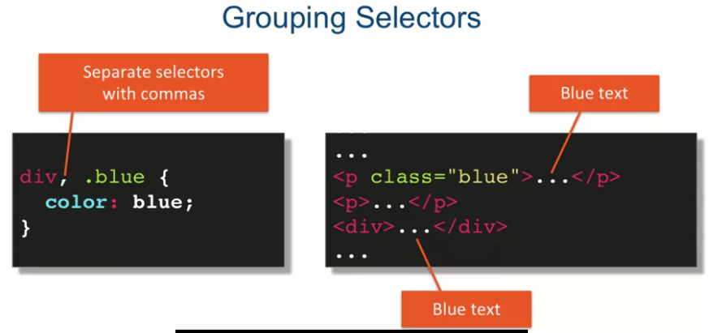

**CSS** stands for Cascading Style Sheets. This programming language dictates how the HTML elements of a website should actually appear on the frontend of the page.


### Why CSS?
- Reusability
- Maintainability


### How to write CSS

#### CSS Syntax:
```html
selector { 
    property:  value;
}
```

example:

```html
h1 {
    text-align: center;
    color: blue;
}
```

Many property:
* https://developer.mozilla.org/en-US/docs/Web/CSS/Reference

Most simple approaches to styling a element

-  Element Selector
    - html code:
    ```html
    <p>  ...</p>
    ```
    - css code:
    ```html
    p {
        color: blue;
    }
    ```

####  Three approaches to styling **only** some of a particular element

- 01 Classes: named styles
    - html code:
    ```html
    <li class="foodLi"> Chocolate </li>
    <li class="foodLi"> Cherries </li>
    <li class="foodLi"> Ice Cream </li>
    ```
    - css code:
    ```css
    .foodLi {
        color: green;
    }
    ```
  
- 02 IDs: name *one* element
    - html code:
    ```html
    
    ```
    - css code:
    ```css
    #cakeImg {
        float: right;
    }
    ```

what's more,group two approaches ,like this ↓



- 03 Combinators: select by relationship
    - Style `<li>`inside of `<ul>`:
    ```css
    ul li {
        ....
    }
    ```

    -  Element with class selector
    ```html
    <p class="big">font size will be 20px</p>
    <div clas="big">unaffected text</div>
    ```

    ```css
    p.big {
        font-size: 20px;
    }
    ```

    - [More adanced relationships exist](https://github.com/jhu-ep-coursera/fullstack-course4/blob/master/Lecture-Slides/Lecture14-CombiningSelectors.pdf)


#### Pseudo-Class Selectors
> Pseudo-Class: 伪类

A CSS pseudo-class is a keyword added to a selector that specifies a special state of the selected element(s). For example, :hover can be used to change a button's color when the user's pointer hovers over it.
```css
/* Any button over which the user's pointer is hovering */
button:hover {
  color: blue;
}
```

- syntax:

```html
selector:pseudo-class {

}
```

- often used :
    - `:link`
    - `:visited`
    - `:hover`
    - `:active`
    - `:nth-child`

- [More Pseudo-Class Selectors ](https://developer.mozilla.org/en-US/docs/Web/CSS/Pseudo-classes)


#### Style placement
https://www.bitdegree.org/learn/inline-css


- Inline CSS
> the least reusable way of styling elements there is

`<p style="text-align: center;"> I am centered!</p>`

- Interal CSS(or head style)
```html
<head>
  <style type = text/css>
    body {
        background-color: blue;
        font-size: 130%;
    }
  </style>
</head>
```

- External CSS
```html
<head>
  <link rel="stylesheet" type="text/css" href="style.css">
</head>
```
summary:
* placing styles inline is great for quick testing
* real sites almost always use external styles
* head styles are usually there to override external ones


[CSS ZEN GARDEN](http://www.csszengarden.com/) has 200 designs submitted now and hosted on this website.
