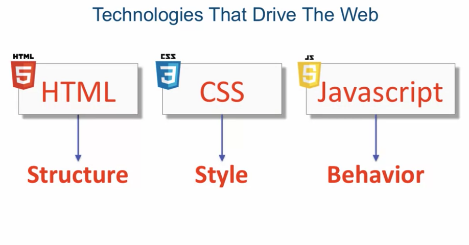

An overview:

- HTML provides the basic structure of sites, which is enhanced and modified by other technologies like CSS and JavaScript.
- CSS is used to control presentation, formatting, and layout.
- JavaScript is used to control the behavior of different elements.

- Source on coursera
    - address -> https://www.coursera.org/learn/html-css-javascript-for-web-developers/
    - [lesson code example on gitub](https://github.com/jhu-ep-coursera/fullstack-course4/tree/master/examples)
    - [Slides on github](https://github.com/jhu-ep-coursera/fullstack-course4/tree/master/Lecture-Slides)

- Tools
    - https://codepen.io
    - [Color picker tool](https://developer.mozilla.org/en-US/docs/Web/CSS/CSS_Colors/Color_picker_tool)
    - https://imagecolorpicker.com/
    - [140 Color Names](https://www.w3.org/TR/2018/REC-css-color-3-20180619/#svg-color)
    
my account: github account (qinrui777)

