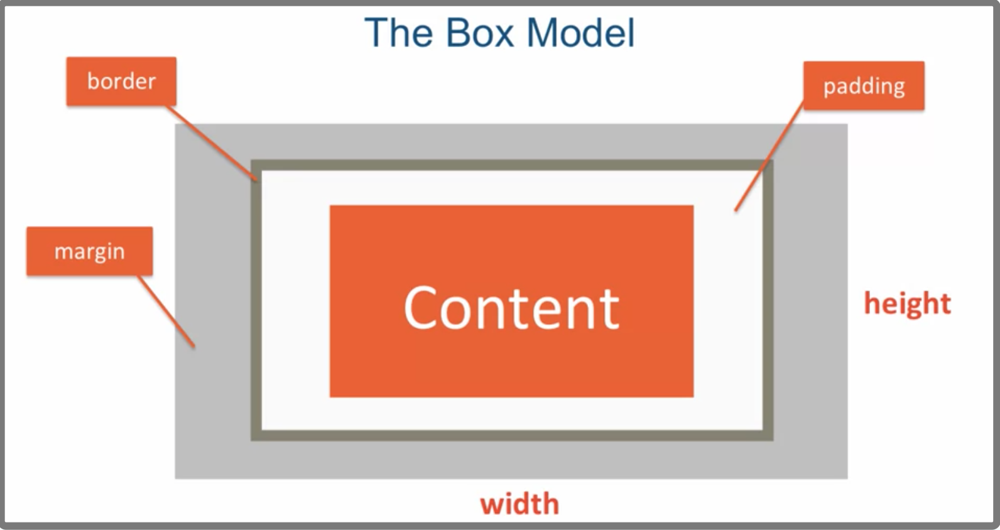
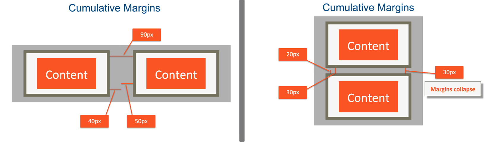
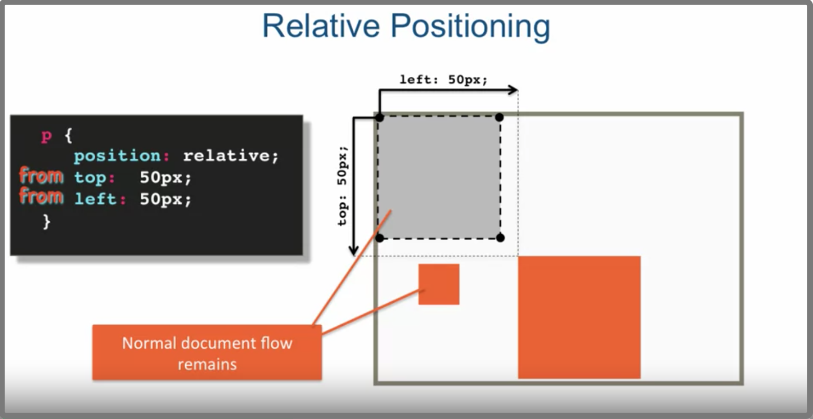

In HTML ,every element is considered a box.

### a simple diagram


border 
margin
padding: 填充，内边距


#### 1.box-sizing

Syntax

`box-sizing`: `content-box` | `border-box` ;

Value
- content-box
    - The width and height properties include the content, but does not include the padding, border, or margin. 

- border-box
    - The width and height properties include the content, padding, and border, but do not include the margin.

*Prefer* `box-sizing: border-box`

**box sizing** is one of those CSS properties that is not inherited. You can't set it on the parent element and then expect that the child elements will inherit that property. 

So how do we get around that? Well, the way we get around it is by learning about one more selector. And that selector is the star selector

```html
<style>
* {
    box-sizing: border-box;
}
...
```

`*` selector

Select all elements


### Cumulative and collapsing Margins
> Cumulative: 累加，累积的;  collapse: 折叠，倒塌



For margin top for the bottom, the larger margin wins.


###  overflow
`overflow`

值	| 描述
----|---
visible	| 默认值。内容不会被修剪，会呈现在元素框之外。
hidden	| 内容会被修剪，并且其余内容是不可见的。
scroll	| 内容会被修剪，但是浏览器会显示滚动条以便查看其余的内容。
auto	| 如果内容被修剪，则浏览器会显示滚动条以便查看其余的内容。
inherit	| 规定应该从父元素继承 overflow 属性的值。

### background
```html
background-color: blue;
background-image: url("relative_path.png");
background-repeat: no-repeat;
background-position: bottom right;
```

equal to 

`background: url('relative_path.png') no-repeat right center blue;`

### float
example code: https://github.com/jhu-ep-coursera/fullstack-course4/tree/master/examples/Lecture21

summary:
- Floating elements can produce very flexible layouts
- Floats are taken out of normal document flow
- Floats don't have vertical margin collapse
- To resume normal document flow ,use the  `clear` property


###  Relative and Absolute Element Positioning

有点儿复杂，需要多看

#### Static Positioning

Normal document flow.Default for all, except html (**html actually has it's positioning set to relative**).

- positioning offsets are ignored


####  Relative Positioning
Element is postioned relative to its position in normal document flow.

- Positioning CSS (offset) properties are: top ,bottom, left ,right
- Element is **Not** taken out of normal document flow: Even if moved, its original spot is preserved




#### Absolute Positioning
All offsets(top,bottom,left,right) are relative to the position of the nearest ancestor which has positioning set on it, other than static.

- By default ,html is the only element that has non-static positinoing set on it (relative).
- Element is taken out of normal document flow.