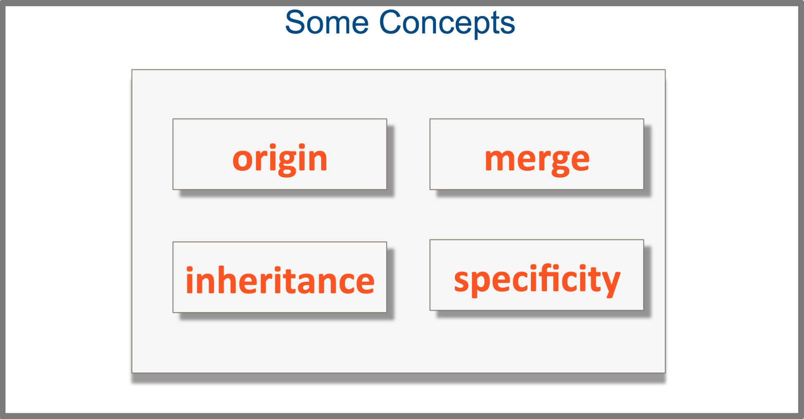
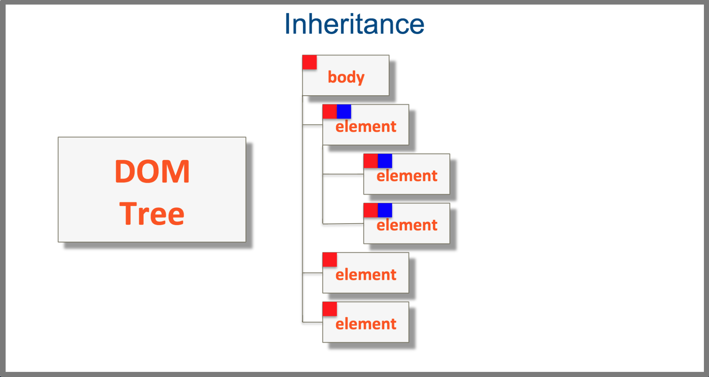

The cascade combine the importance, origin, specificity and source order of the applicable style declarations to determine exactly which declaration should be applied to any given element. And if there's a conflict, how to resolve that conflict. In other words, **how to tell which CSS rule wins**. 

### 1.origin
origin precedence (when in conflict)  -> **Rule: Last Declaration Wins**
- HTML is processed sequentially, top to bottom.
- For precedence, think of external CSS as declared at the spot where it's linked to
> 对于第2点的大致解释，一般external CSS 在html文件的最top申明，根据第一条，如果与下面申明的有冲突，就采用下面的（最后申明的属性）)

### 2.merge
(when no conflict) -> **Rule:Delcarations Merge**

### 3.inheritance

### 4.specificity
**Rule: Most specific selector combination wins**

a pretty straightforward technique that will let you figure out which selector combinations are most specific than others. You can think of specificity of your selectors as keeping a score. The selectors with the highest score win.

`!important`: This declaration overrides any other declarations.  
[about the important rule ](https://developer.mozilla.org/en-US/docs/Web/CSS/Specificity#The_!important_exception)
